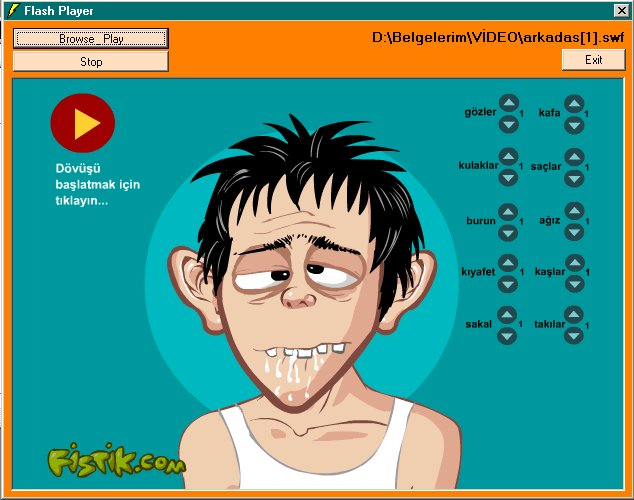



## Flash Player with MS Internet Control

### Description

this code shows how to play flash movies with

MS internet control(i know i can use shockwave control but i try some different ways in vb)
 
### More Info
 

             |
---                |---
**Submitted On**   |2000-12-23 22:00:22
**By**             |[albaarn from turkey](https://github.com/Planet-Source-Code/PSCIndex/blob/master/ByAuthor/albaarn-from-turkey.md)
**Level**          |Intermediate
**User Rating**    |3.8 (15 globes from 4 users)
**Compatibility**  |VB 4\.0 \(16\-bit\), VB 4\.0 \(32\-bit\), VB 5\.0, VB 6\.0, VB Script
**Category**       |[Graphics](https://github.com/Planet-Source-Code/PSCIndex/blob/master/ByCategory/graphics__1-46.md)
**World**          |[Visual Basic](https://github.com/Planet-Source-Code/PSCIndex/blob/master/ByWorld/visual-basic.md)
**Archive File**   |[CODE\_UPLOAD1298512232000\.zip](https://github.com/Planet-Source-Code/albaarn-from-turkey-flash-player-with-ms-internet-control__1-13821/archive/master.zip)

